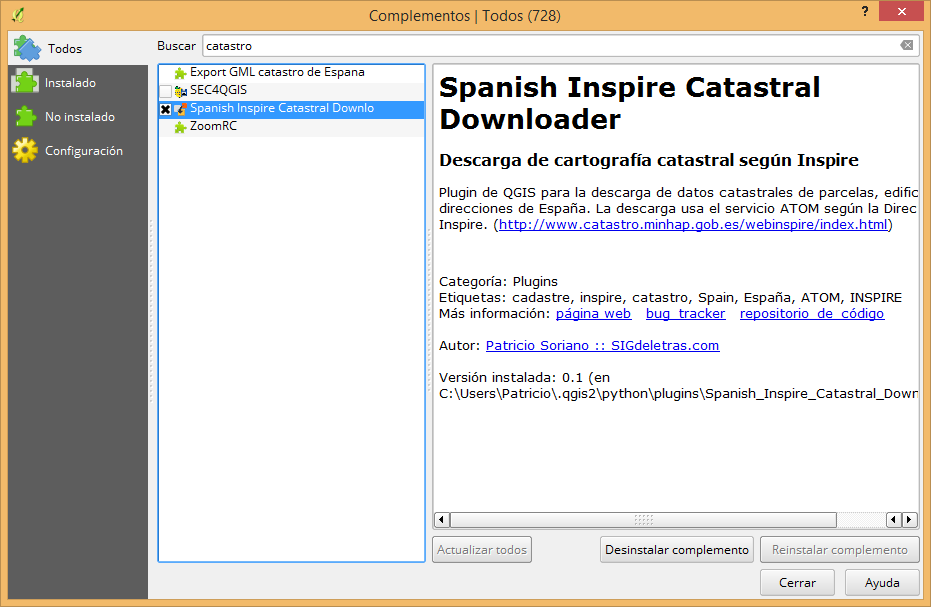
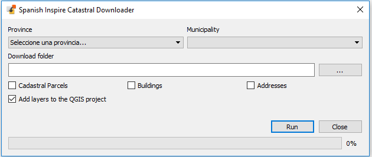

# Spanish Inspire Catastral Downloader (V1.1) 

Plugin de QGIS para la descarga de datos catastrales de parcelas, edificios y direcciones de España. La descarga usa el servicio ATOM según la Directiva Inspire. (<a href='http://www.catastro.minhap.gob.es/webinspire/index.html'>http://www.catastro.minhap.gob.es/webinspire/index.html</a>)

<i>QGIS Plugin for the download of cadastral data of parcels, buildings and addresses of Spain. The download uses the ATOM service according to the Inspire Directive. (<a href='http://www.catastro.minhap.gob.es/webinspire/index_eng.html'>http://www.catastro.minhap.gob.es/webinspire/index_eng.html</a>)</i>

Para más información puede consultarse la entrada en [SIGdeletras.com](http://www.sigdeletras.com/2017/blog/plugin-de-qgis-para-descarga-de-datos-catastrales-inspire/)

## Instalar plugin

**Disponible para QGIS 2.18.* y 3.0.***

El complemento puede ser instalado desde el menú <b>Complementos>Administrar e instalar complementos</b> de QGIS. Para localizar de forma rápida el complemento puede introducirse el término <i>"catastro"</i> en la herramienta de búsqueda.

Igualmente, puede descargarse el archivo zip desde este repositorio y <b>descomprimirlo en la carpeta de plugins de QGIS</b> según el sistema operativo.

Para QGIS 2.18.* :

<ul>
<li>Windows: <i>c:\Users\username\.qgis2\python\plugins</i></li>
<li>Mac: <i>/Users/username/.qgis2/python/plugins</i></li>
<li>Linux: <i>/home/username/.qgis2/python/plugins</i></li>
</ul>
Donde tendremos que reemplazar “username” por nuestro usuario.

## Uso

Tras su instalación el plugin puede ser ejecutado desde la barra de herramientas o bien desde el menú <b>Complementos>Descarga Catrastro Inspire</b> o bien <b>Spanish Inspire Catastral Downloader</b> si tenemos instalado QGIS en otro idioma.

Una vez ejecutado el complemento se debe <b>obligatoriamente</b>:
<ul>
<li>Seleccionar la provincia</li>
<li>Seleccionar el municipio</li>
<li>Indicar la ruta local de descarga</li>
<li>Indicar el conjunto de capas a descargar: Parcelas Catastrales, Edificios y/o Direcciones</li>
</ul>

El programa descarca los GML correspondientes y lso convierte a formato GeoJSON en la ubicación indicada y dentro de una carpeta con el códifo INE del municipio seleccionado. Si se desea añadir las capas GeoJSON descargardas al proyecto QGIS activo se debe marcar la casilla correspondiente. Si se desea pueden cargarse a posteriori tanto los GeoJSON como los GML originales, aunque en la versión QGIS 3.* no se visualizan correctamente los GML catastrales tal y como son suministrados.

### Conjunto de datos INSPIRE de la Dirección General de Catastro

Los archivos geográficos (GML) contenidos en cada conjunto de datos son:

- **Conjunto de Datos de Parcela Catastral** (CP Cadastral Parcel)
  - *CadastralParcel*. Parcela catastral.
  - *CadastralZoning*. Manzanas en suelo urbano o a los polígonos en suelo rústico.
- **Conjunto de Datos de Edificios** (BU Buildings)
  - *Building*. Edificio. 
  - *BuildingPart*. Cada una de las construcciones de una parcela catastral que tiene volumen homogéneo, y pueden ser sobre y bajo rasante.
  - *OtherConstructions*. Piscinas que contienen el atributo OtherConstructionNatureValue calificado cómo openAirPool.
- **Conjunto de Datos de Direcciones** (AD Addresses)
  - *Address*. Geometría del punto donde georreferencia la dirección física (centroide de la parcela o entrada del portal)

El PDF con la descripción completa de la estructura de datos puede consultarse en el siguiente [enlace](http://www.catastro.minhap.es/webinspire/documentos/Conjuntos%20de%20datos.pdf)

## 2DO

- Posibilidad de applicar simbología a las capas

## Changelog
- 22.06.2018 V1.1: Se cambia el nombre de la carpeta de descarga, dejándo solo el códifo INE. Soluciona problemas de espacios en la ruta utilizada para convertir los GML a GeoJSON.
- 17.06.2018 V1.0: PR de Fran Raga: Arregla errores de la API para QgsMessageBar. Para salvar el error de carga de GML en QGIS3, son convertidos a geojson. Sobre el PR de Fran: Añadido try/except para que pueda ser usado por QGIS 2.* Se añade el EPSG:25830 de salida para la conversión de los geojson.
- 11.06.2018 V0.6: Errores en nombres de municipios con cedilla (issue de [Carlos Cámara](https://github.com/ccamara) . Bajada de versión hasta 2.99 por fallo de carga del GML en QGIS 3 y error en la API.
- 09.09.2017 V0.5: Barra de progreso. Mejora en la interfaz e iconos. Descarga bajo un proxy. Codificación. (PR de [Francisco Raga](https://github.com/All4Gis).
- 28.08.2017 V0.4: Cambios para QGIS3
- 28.08.2017 V0.3.1: Errores en nombres de municipios con punto.
- 21.07.2017 V0.3: Corregidos paths para que funcione en todos los OS (por Raúl Nanclares)
- 21.07.2017 V0.2: Se añaden las "gerencias" de Gijón, Jerez, Vigo, Ceuta y Melilla (por Francisco Pérez Sampayo)
- 19.07.2017 V0.1: Primera versión
